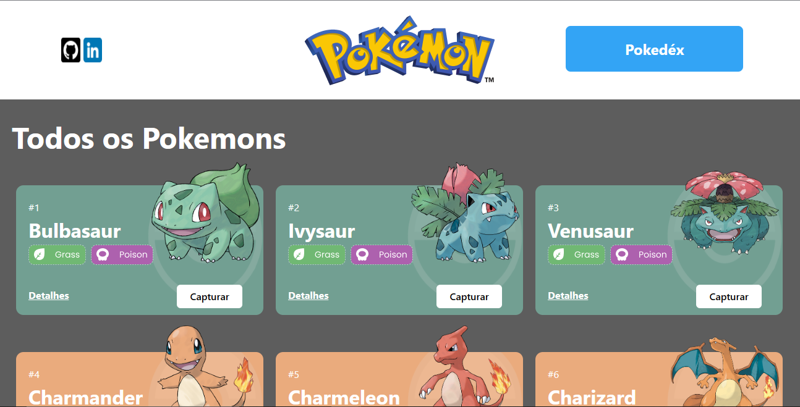

# # Projeto React e API's Pokedex

O Projeto React e APIs é um site de pokémons.

## Deploy (visualize o site)

http://aureana-pokemon.surge.sh/

#
## Stack utilizada: Front-end: 
React-router-dom

Styled-components

React-modal

Requisições com Axios 
#

## Funcionalidades1- Home

Lista 27 pokémons com seus respectivos nomes e tipos. Possui botões de capturar e para ver os detalhes. Clicando em Next traz mais resultados de Pokémons.

2- Pokédex

Mostra quantidade de pokémons capturados, podendo remover um ou todos os pokémons de uma vez.

3- Detalhes

Possui botões de capturar ou remover da pokédex, mostra alguns detalhes sobre o pokémon como os movimentos, e detalhes sobre a sua força.

#
## Como rodar este projeto?

´´´bash
## clone este repositório
$ git clone https://github.com/Aureana/projeto-react-apis.git

## Acesse a pasta do projeto no seu terminal
$ cd projeto-react-apis

## Instale as dependências
$ npm install

## Execute a aplicação
$ npm run start

# A aplicação será iniciada na porta 3000, acesse pelo navegador

#

#

## 🚀 Sobre mim
 Olá, me chamo Aureana!👋 Eu sou uma pessoa desenvolvedora full-stack, apaixonada por tecnologia!💖

## 🔗 Links

